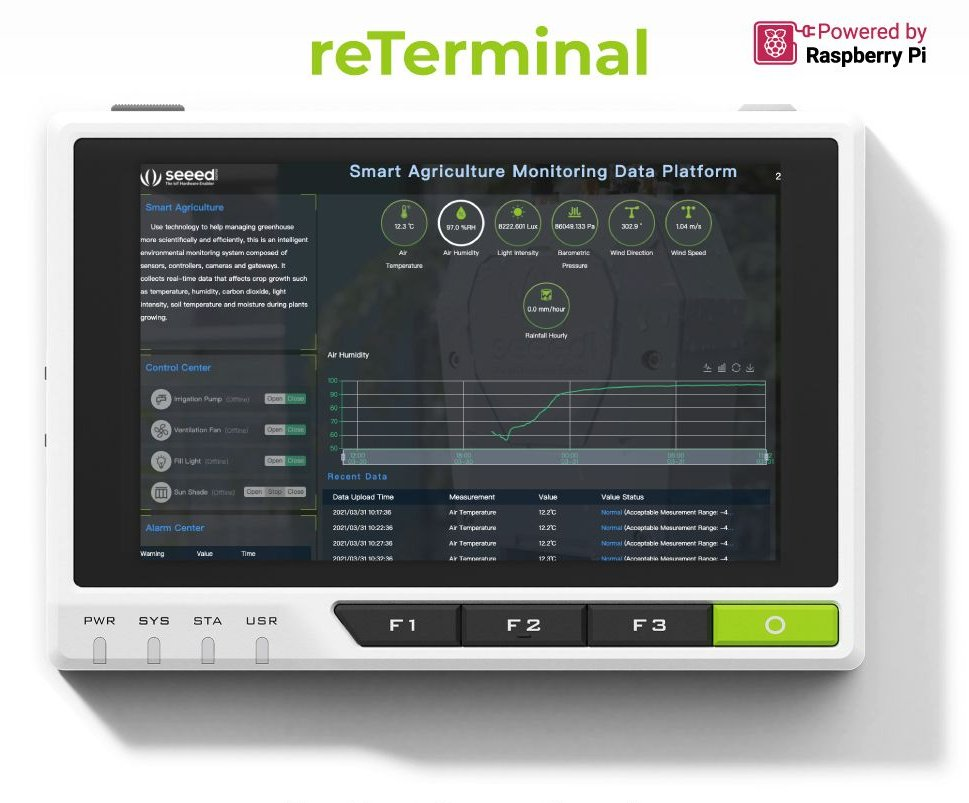
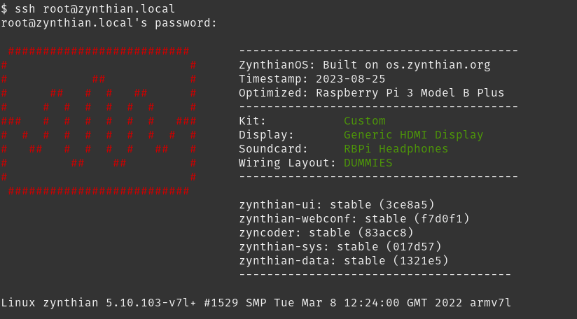
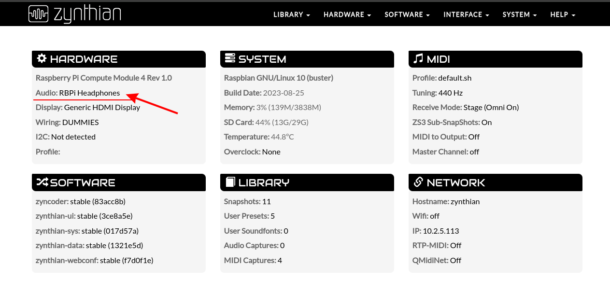
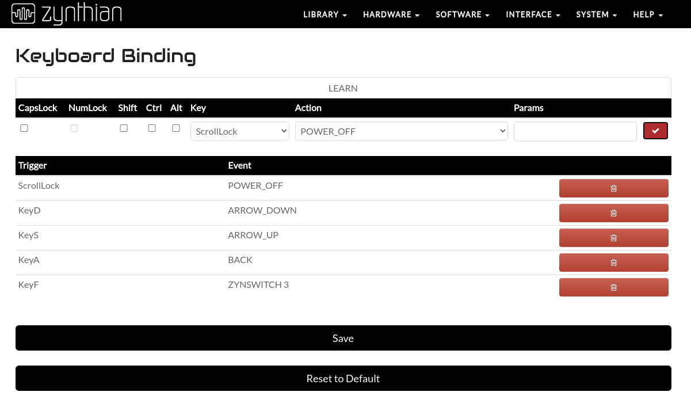

# Overview

This document explains the process of installing Zynthian in a [reTerminal](https://www.seeedstudio.com/ReTerminal-with-CM4-p-4904.html). The reTerminal is an embedded device which have a Raspberry Pi CM4, an LCD display, a multi-touch screen panel, some buttons and a very nice case. My model is the CM4 4032, so I have **4 GiB of RAM and 32 GiB of eMMC** storage.



> Disclaimer: I will assume in this guide that you have some minimal knowledge about Linux, command terminals, scripts, and so on. Nevertheless, just running the given steps will work, even whithout knowing what exactly they do.


## Some considerations

One important thing to note with this device is that it **does NOT have any sound interface** (at least, not exposed directly). Talking about installing Zynthian, this is a big issue. You can, nevertheless, use the exposed 40 pin header to add a RPi sound module, or, as in my case, use an external USB audio interface. It works without any problem.

On the other hand, as you will see in a moment, this device does not use the SD card to boot up the system. This means that the **installation procedure is a bit more complex** than with a normal Raspberry Pi. But not much more :) .

Let's begin!


# Zynthian installation

Of course, and first of all, you need to **download the Zynthian OS image** from the official web page. It's around 8 GiB (12/2023), so it may take a while to download (but you won't sit and wait, there is work to do!).

* [Zynthian OS last stable image](https://os.zynthian.org/zynthianos-last-stable.zip)
* [Zynthian.org Software](https://zynthian.org/#software)

## Entering 'flash mode'

Now, in order to flash the operating system into the eMMC, you need to boot it in a special mode. To do so, you need to remove the back cover and the heatsink, and flip down the boot switch inside. Then, after installing the drivers in your PC/Mac, connect the reTerminal to your host using the USB-C cable. If everything is ok, your host will see it like an USB drive. The whole process is very well explained in the official Wiki, here:

* [Flash Raspberry Pi OS/ 64-bit Ubuntu OS or Other OS to eMMC](https://wiki.seeedstudio.com/reTerminal/#flash-raspberry-pi-os-64-bit-ubuntu-os-or-other-os-to-emmc)

> NOTE: The back cover has two tabs around the middle screw holes. Once the four corner screws are removed, these tabs keep the cover from being released. You may need to insert something from both sides to pry them (with care) and be able to quit the cover. I did remove these tabs for easy future access.

## Writing the Zynthian image

Once the reTerminal is in *flash mode*, and you unzipped de Zynthian image, you can use the [Raspberry Pi Imager](https://www.raspberrypi.com/software/) to flash it. Select "Choose OS > Use Custom" to use the provided Zynthian `.img` file, and also select the eMMC device as destination. Press write and wait. In my case, it took around 15-20 minutes, so it's time for a coffee break :) .

---

When finished, you can close the RPi Imager, and **umount/disconnect** the reTerminal from your host. Then, flip up the boot switch (so it can boot in normal mode again), screw the heatsink and the back cover, and you are ready for the first boot!

# Installing reTerminal drivers

**Before you plug in the power supply** to your reTerminal, you must know that there are some drivers that need to be installed. So, the first time you power up your device, the LCD will not work, and you will not be able to see anything there. Moreover, the Zynthian UI will not start because the configured sound card does not exist. But, not to worry, we will fix everything in a while. So, are you ready?

Then, connect an **ethernet** cable and the **power** adapter to your reTerminal and wait. The first time it boots, it will make some automatic adjustments and is important to be patient. But, as you don't have the screen, how do you know that it is finished? Well, you may connect an external display using the micro-HDMI connector. But, as the UI is not booting up properly, it won't help you that much.

The solution to this situation is SSH. You can connect using an SSH client to your reTerminal, and then fix these problems. When the device has booted up, it will have an IP address, which is what we need to know. Or, as it was my case, if your system supports mDNS, use the name `zynthian.local` (or maybe `.lan`, which depends on your network settings). All these things are well explained in the [Zynthian Wiki](https://wiki.zynthian.org/index.php/Accessing_Zynthian_from_your_computer). So, launch a ping to that host, and wait until it responds. And then, connect using SSH (user is `root` and password is `raspberry`). You may just run the following command:

```shell
ssh root@zynthian.local
```

Once you are inside the reTerminal, it's time to download the needed drivers. This process is also well explained in the reTerminal WiKi: [Install reTerminal drivers after flashing new Raspberry Pi OS/ Ubuntu OS or Other OS](https://wiki.seeedstudio.com/reTerminal/#install-reterminal-drivers-after-flashing-new-raspberry-pi-os-ubuntu-os-or-other-os). Create a directory called `drivers`, enter it and clone the following repository:

```shell
mkdir drivers
cd drivers
git clone --depth 1 https://github.com/Seeed-Studio/seeed-linux-dtoverlays
```

Now, enter in that directory and run the installation:

```shell
cd seeed-linux-dtoverlays
./scripts/reTerminal.sh
```

This will install some packages, and compile the kernel modules needed for the hardware to work. It will take a while, so wait patiently again :).

---

Whe the script finished, it will instruct you to reboot, and we obediently do so. If everything goes well, after rebooting the display will show the Zynthian logo while it tries to start. But it will restart again and again, and the reason is the sound card. When you entered in the ssh terminal, you probably saw something like this:



As you can see, the selected soundcard is `RBPi Headphones`, but the CM4 (and thus the reTerminal) does not have such a thing. We need to change it, so open the web configuration interface of Zynthian (http://zynthian.local) in your browser, and go to Hardware > Audio.



There, for now, select `Dummy Device` and click 'Save'. It will ask you to reboot, but if you do, you will loose the screen again. Why? Because when you pressed 'Save', Zynthian modified the file `/boot/config.txt`, which was also changed by the driver installation of reTerminal (changes that have been lost). So, before rebooting, go to Hardware > Options, click on 'Advanced view', and put the following lines in the `Custom Config` area:

```
dtoverlay=reTerminal
```

Now click 'Save' again, and reboot (you may need to reboot from inside the SSH terminal, as the Zynthian UI is not working properly yet). Then, after the reboot, you must see the Zynthian UI in the reTerminal screen. Congratulations! Next thing to do: fix the touch screen panel.

## Fixing touch screen

Before doing anything else, is a good idea to update the software to the latest release. You can do it using the web interface. Go to 'Software > Update' and click on the button `Update Software`. Wait until finishes. This will update the Zynthian software, but not the system packages. If you also want to upgrade the system, open an SSH terminal and run (and reboot when finished):

```shell
apt update
apt upgrade -y
```

Ok, ready for fixing the touch screen. The problem is simple: the X asis is inverted. And the fix is also very simple. Connect to reTerminal using SSH, and open the file `/usr/share/X11/xorg.conf.d/40-libinput.conf`. Using `nano`, the command would be:

```shell
nano /usr/share/X11/xorg.conf.d/40-libinput.conf
```

There, look for the section `InputClass` with the Identifier `libinput touchscreen catchall`, and in that section, add the following option: `Option "InvertX" "1"`. The whole section would be as follows:

```
Section "InputClass"
        Identifier "libinput touchscreen catchall"
        MatchIsTouchscreen "on"
        MatchDevicePath "/dev/input/event*"
        Driver "libinput"
        Option "InvertX" "1"
EndSection
```

Save the file (press `Ctrl + X`, then `Y`, then `Enter`), and restart Zynthian service:

```shell
systemctl restart zynthian
```

Press the Main channel mute button to check if the touch screen is working. Or press in the upper left corner to open the main main. If it works, give yourself a pat in the back! ;) Next step? The sound system.


## Fixing sound system

As we said earlier, this device **does not have a soundcard** (as far as I know), so I will use an external USB card. The problem with these cards is that they may be enumerated differently on every boot. So, for instance, if you instruct Zynthian to use the device number 3 (because the USB sound card now has the id number 3), and on next reboot it gets the number 2, Zynthian will not be able to start. How to fix it? Well, there are many ways. What I've choosen to do here is to setup ALSA (the sound system) to give any USB sound card a fixed number. If you only have one, this fix may work for you too.

How to do it? Again, connect to reTerminal using SSH, and create the file `/etc/modprobe.d/alsa-base.conf`. With nano, the command would be:

```shell
nano /etc/modprobe.d/alsa-base.conf
```

There, enter the following line (I've choosen the index number 5, you can pick up the number of your preference):

```
options snd_usb_audio index=5
```

Save the file (press `Ctrl + X`, then `Y`, then `Enter`), and connect your USB device. To check that it received the number that you want, run `aplay -l`, and check the name of your cards. In my case, I'm using a Hercules DJControl Starlight as sound interface, so that command says:

```shell
**** List of PLAYBACK Hardware Devices ****
card 0: Dummy [Dummy], device 0: Dummy PCM [Dummy PCM]
[...]
card 5: Starlight [DJControl Starlight], device 0: USB Audio [USB Audio]
  Subdevices: 1/1
  Subdevice #0: subdevice #0
```

Now, you can go again to the Zynthian web configuration interface, to 'Hardware > Audio'. There, change the `Dummy Device` that we put earlier, and set it to `Custom Device`. Check the `Advanced View` box, and observe the field `Jackd Options`. There, by default you will find this option: `-d hw:0`. Change it with the index that you put in the `alsa-base.conf` file. I used 5, so the option would be, in my case: `-d hw:5`. Press 'Save' and, as instructed, reboot.

Once rebooted, you can check that the audio is working. Using the touch screen, press upper left corner to enter the main menu. There, go to 'Admin' and press 'Test Audio' to verify that it works.


## Using reTerminal buttons

The reTerminal has 5 physical buttons: 4 in the front, labelled F1, F2, F3 and a green one with a circle; and one more in the upper side. These buttons are mapped by the driver as the keys 'A', 'S', 'D', 'F' (for the front buttons) and SLEEP (for the upper side one), respectively. I'm perfectly fine with the ASDF keys, but not that much with the SLEEP key, as it could not be mapped inside Zynthian.

Let's change it for something that Zynthian recognizes. I've choosen a key that can be used withouot modifiers (i.e. shift, control or alt), but that is rarely used (so that, in case you connect a keyboard, you don't fire that function by accident): Scroll Lock. So, open an SSH console to your reTerminal, and go to the driver directory:

```shell
cd drivers/seeed-linux-dtoverlays/overlays/rpi/
```

Open (with nano) the file called `reTerminal-overlay.dts`, and go to the section called `fragment@7` (nearly the end of the file). There, you can see the GPIO keys mapping. In the case `pwr_btn`, change its `linux,code` value for the selected KEY code. In my case, Scroll Lock is 70, so the whole block would be like this:

```c++
    pwr_btn: pwr_btn {
        debounce-interval = <5>;
        linux,code = <70>; /* PWR_KEY, KEY_SCR_LOCK */
        label = "power_key";
        gpios = <&gpio 13 1>;
        gpio-key,wakeup;
        autorepeat;
    };
```

Save the file, and then re-run the installation script:

```shell
cd ~/drivers/seeed-linux-dtoverlays/
scripts/reTerminal.sh
```

After that, the script will have changed the file `/boot/config.txt` (just like Zynthian did before), and it added some options that we don't need. You can discard the changes going to the Zynthian web interface, to Hardware > Options, and pressing 'Save' (there is no need to change anything).

Now, you can reboot as instructed. Once the system is up again, go to the web interface and bind these keys to something useful for you. In my case, F1 is 'Back', F2 is 'Up', F3 is 'Down', green button is 'Enter' and the upper side button is 'Power Off'. The mapping is something like this:




# References

### Zynthian

* [Zynthian](https://zynthian.org/)

### reTerminal
* [Seeed Studio shop: reTerminal](https://www.seeedstudio.com/ReTerminal-with-CM4-p-4904.html)
* [reTerminal Wiki](https://wiki.seeedstudio.com/reTerminal/)
* [reTerminal: installing an OS to the eMMC](https://wiki.seeedstudio.com/reTerminal/#flash-raspberry-pi-os-64-bit-ubuntu-os-or-other-os-to-emmc)
